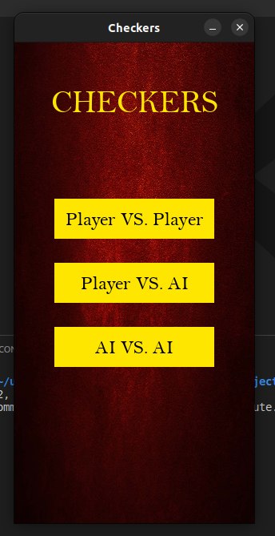
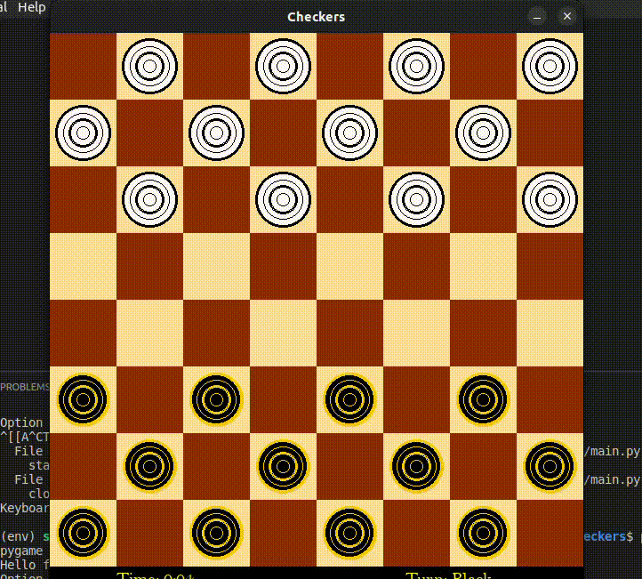
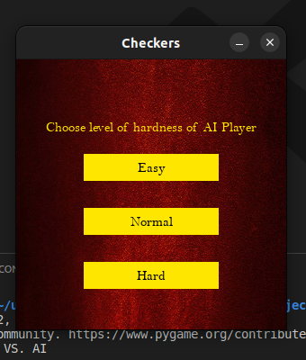
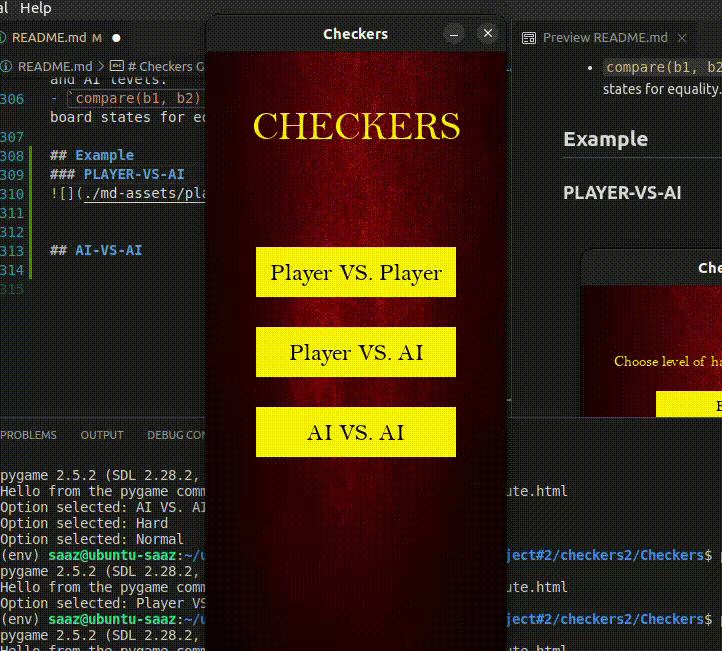
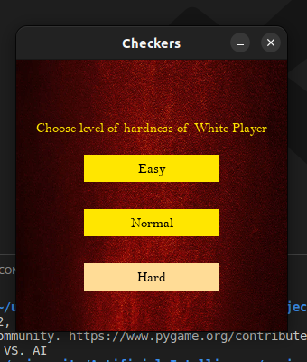
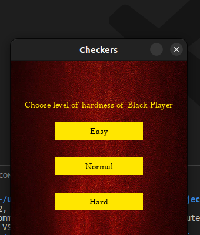
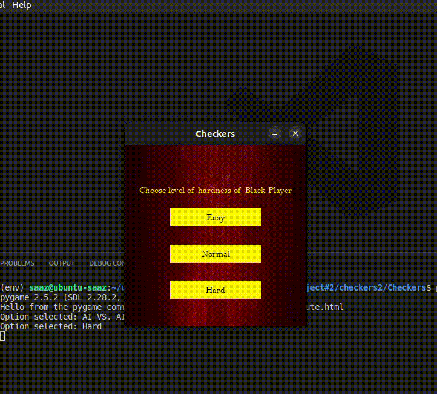

# Checkers Game Documentation

## Table of Contents

- [Checkers Game Documentation](#checkers-game-documentation)
  - [Table of Contents](#table-of-contents)
  - [1. Overview ](#1-overview-)
  - [2. Installation ](#2-installation-)
  - [3. Game Modes ](#3-game-modes-)
  - [4. AI Levels ](#4-ai-levels-)
  - [5. Code Structure ](#5-code-structure-)
  - [6. Classes and Methods ](#6-classes-and-methods-)
    - [`constants.py` ](#constantspy-)
      - [Constants](#constants)
    - [`board.py` ](#boardpy-)
      - [`Board` Class](#board-class)
        - [Attributes](#attributes)
        - [Methods](#methods)
    - [`ai.py` ](#aipy-)
      - [AI Functions](#ai-functions)
    - [`piece.py` ](#piecepy-)
      - [`Piece` Class](#piece-class)
        - [Attributes](#attributes-1)
        - [Methods](#methods-1)
    - [`game.py` ](#gamepy-)
      - [`Game` Class](#game-class)
        - [Attributes](#attributes-2)
        - [Methods](#methods-2)
    - [`main.py` ](#mainpy-)
      - [Main Functions](#main-functions)
  - [Example](#example)
    - [MAIN WINDOW](#main-window)
    - [PLAYER-VS-PLAYER](#player-vs-player)
    - [PLAYER-VS-AI](#player-vs-ai)
  - [AI-VS-AI](#ai-vs-ai)

## 1. Overview <a name="#overview"></a>

The Checkers Game project is an implementation of the classic checkers game using the Pygame library. It provides various game modes, including player vs. player, player vs. AI, and AI vs. AI. The AI player uses the minimax algorithm with alpha-beta pruning and forward prunning for making intelligent moves.

## 2. Installation <a name="installation"></a>

To run the Checkers Game, follow these steps:

```bash
# Clone the repository
git clone git@github.com:amax33/Checkers.git

# Navigate to the project directory
cd Checkers

# Install dependencies
# Windows
pip install -r requirements.txt

# Linux & Mac
pip3 install -r requirements.txt


# Run the game

# Windows
python main.py

# Linux & Mac
python3 main.py
```

## 3. Game Modes <a name="game-modes"></a>

The project supports the following game modes:

- **Player vs. Player**: Two human players take turns making moves.
- **Player vs. AI**: A human player competes against the AI, with adjustable difficulty levels.
- **AI vs. AI**: Watch two AI players battle it out with adjustable difficulty levels.

## 4. AI Levels <a name="ai-levels"></a>

The AI difficulty levels available are:

- **Easy**
- **Normal**
- **Hard**

Players can choose the AI difficulty level when playing against the AI.

**Note:** You can change default value of:
- **Easy = 1**
- **Normal = 3**
- **Hard = 7**

from `constants.py` to your own value.

## 5. Code Structure <a name="code-structure"></a>

The project is structured into several Python files:

- **constants.py**: Defines constants used throughout the project.
- **board.py**: Contains the `Board` class for managing the game board.
- **ai.py**: Implements the minimax algorithm with alpha-beta pruning for AI moves.
- **piece.py**: Defines the `Piece` class representing individual checkers pieces.
- **game.py**: Contains the `Game` class for managing game state, player moves, AI moves, and game logic.
- **main.py**: The main script that initializes the game and handles user input.

## 6. Classes and Methods <a name="classes-and-methods"></a>

### `constants.py` <a name="constantspy"></a>

This file contains various constants used throughout the project.

#### Constants

- **Colors:**
  - `WHITE`: RGB tuple representing the white color.
  - `BLACK`: RGB tuple representing the black color.
  - `GRAY`: RGB tuple representing the gray color.
  - `BEIGE`: RGB tuple representing the beige color.
  - `GOLD`: RGB tuple representing the gold color.
  - `DARK_GOLD`: RGB tuple representing the dark gold color.
  - `DARK_RED`: RGB tuple representing the dark red color.

- **Game Dimensions:**
  - `WIDTH`: Width of the game window.
  - `HEIGHT`: Height of the game window.
  - `SQUARE_SIZE`: Size of each square on the game board.
  - `FPS`: Frames per second for game rendering.

- **Game Modes:**
  - `PLAYER_VS_PLAYER`: Mode constant for player vs. player.
  - `PLAYER_VS_AI`: Mode constant for player vs. AI.
  - `AI_VS_AI`: Mode constant for AI vs. AI.

- **AI Levels:**
  - `EASY`: Constant representing easy AI level.
  - `NORMAL`: Constant representing normal AI level.
  - `HARD`: Constant representing hard AI level.

### `board.py` <a name="boardpy"></a>

This file contains the `Board` class, which manages the game board.

#### `Board` Class

##### Attributes

- `board`: 2D list representing the game board with pieces.
- `pieces`: List containing active pieces on the board.

##### Methods

- `__init__(self)`: Initializes the board with pieces placed in the starting positions.
- `get_piece(self, row, col) -> Piece`: Retrieves the piece at the specified row and column.
- `move(self, piece, row, col) -> None`: Moves a piece to the specified row and column.
- `remove(self, piece) -> None`: Removes a piece from the board.
- `draw(self, win) -> None`: Draws the game board on the window.
- `get_valid_moves(self, piece) -> Dict[Tuple[int, int], Union[None, Tuple[int, int]]]`: Returns valid moves for a piece.

### `ai.py` <a name="aipy"></a>

This file contains the AI-related functions for making moves.

#### AI Functions

1. `minimax_alpha_beta(board, depth, maximizing_player, game, stuck_flag=None, prune=False) -> Tuple[int, List[List[int]]]`

- **Description:**
  - This function implements the minimax algorithm with alpha-beta pruning to find the best move for the AI player.

- **Parameters:**
  - `board` (`List[List[int]]`): The current state of the game board.
  - `depth` (`int`): The depth to which the algorithm should explore the game tree.
  - `maximizing_player` (`bool`): A boolean indicating whether the current player is maximizing (True) or minimizing (False).
  - `game` (`Game`): An instance of the `Game` class representing the current game state.
  - `stuck_flag` (`Optional[Dict[Tuple[int, int], Tuple[int, int]]]`): A dictionary representing the board state in a previous round, used to detect repetitions.
  - `prune` (`Optional[bool]`): A boolean indicating whether to apply alpha-beta pruning.

- **Returns:**
  - A tuple containing the best move's value and the resulting board state.

- **Usage:**
  ```python
  value, new_board = minimax_alpha_beta(current_board, depth, maximizing_player, game_instance)
  ```

- **Example:**
  ```python
  value, new_board = minimax_alpha_beta(current_board, 3, True, game_instance, prune=True)
  ```

NOTE: The project is set to `minimax_alpha_beta` with `prune` argument set to `True` for **The Forward Prunning** 

You can change the algorithm in `main.py` file in section:

**Minimax With Forward Prunning:**

```python
### Forward Prunning Code Example

if game.turn == WHITE:
                    # White AI's turn, use minimax with alpha-beta pruning to make a move
                    value, new_board_white = minimax_alpha_beta(game.get_board(), levelW, False, game, stuck_flag, prune=True)
                    game.ai_move(new_board_white)

                if game.turn == BLACK:
                    # Black AI's turn, use minimax with alpha-beta pruning to make a move
                    value, new_board_black = minimax_alpha_beta(game.get_board(), levelB, True, game, stuck_flag, prune=True)
                    game.ai_move(new_board_black)
                
```

**Minimax With Alpha-Beta:**

```python
### Minimax With Alpha-Beta

if game.turn == WHITE:
                    # White AI's turn, use minimax with alpha-beta pruning to make a move
                    value, new_board_white = minimax_alpha_beta(game.get_board(), levelW, False, game, stuck_flag, prune=False)
                    game.ai_move(new_board_white)

                if game.turn == BLACK:
                    # Black AI's turn, use minimax with alpha-beta pruning to make a move
                    value, new_board_black = minimax_alpha_beta(game.get_board(), levelB, True, game, stuck_flag, prune=False)
                    game.ai_move(new_board_black)
```

**Normal Minimax:**

```python
if game.turn == WHITE:                  
  value, new_board_white = minimax(game.get_board(), levelW, False, game)
  game.ai_move(new_board_white)

if game.turn == BLACK:
  value, new_board_black = minimax(game.get_board(), levelB, True, game)
  game.ai_move(new_board_black)
```


### `piece.py` <a name="piecepy"></a>

This file contains the `Piece` class, representing individual checkers pieces.

#### `Piece` Class

##### Attributes

- `row`: Row position on the game board.
- `col`: Column position on the game board.
- `color`: Color of the piece (white or black).
- `king`: Boolean indicating whether the piece is a king.
- `x`: X-coordinate for rendering on the window.
- `y`: Y-coordinate for rendering on the window.

##### Methods

- `__init__(self, row, col, color)`: Initializes a piece with a specified row, column, and color.
- `calc_pos(self) -> None`: Calculates the rendering position of the piece on the window.
- `make_king(self) -> None`: Makes the piece a king.
- `draw(self, win) -> None`: Draws the piece on the window.
- `move(self, row, col) -> None`: Moves the piece to the specified row and column.

### `game.py` <a name="gamepy"></a>

This file contains the `Game` class, managing game state, player moves, AI moves, and game logic.

#### `Game` Class

##### Attributes

- `selected_piece`: Currently selected piece.
- `board`: Instance of the `Board` class representing the game board.
- `turn`: Current turn color.
- `valid_moves`: Dictionary containing valid moves for the selected piece.
- `win`: Pygame window object.

##### Methods

- `__init__(self, win)`: Initializes the game with default settings.
- `update(self) -> None`: Updates the game state and refreshes the window.
- `draw_selected_piece(self) -> None`: Draws a highlight around the selected piece.
- `_init(self) -> None`: Initializes the game state.
- `reset(self) -> None`: Resets the game state.
- `select(self, row, col) -> bool`: Handles player move selection.
- `_move(self, row, col) -> bool`: Executes the selected move.
- `draw_valid_moves(self, moves) -> None`: Draws indicators for valid moves.
- `winner(self) -> Union[Tuple[int, int, int], None]`: Determines the winner of the game.
- `change_turn(self) -> None`: Switches the turn to the other player.
- `draw_time(self) -> None`: Draws the elapsed time on the window.
- `draw_turn(self) -> None`: Draws the current turn information on the window.
- `get_board(self) -> Board`: Retrieves the game board.
- `ai_move(self, board) -> None`: Updates the game state with an AI move.

### `main.py` <a name="mainpy"></a>

This is the main script that initializes the game and handles user input.

#### Main Functions

- `get_row_col_from_mouse(pos) -> Tuple[int, int]`: Converts mouse position to row and column.
- `display_win_window(winner) -> None`: Displays the window when the game is won.
- `display_options() -> int`: Displays the game mode options and returns the selected mode.
- `level_options(color) -> int`: Displays options for choosing the difficulty level of a player and returns the selected level.
- `start(mode=0, levelW=0, levelB=0) -> None`: Starts the game with specified mode and AI levels.
- `compare(b1, b2) -> bool`: Compares two board states for equality.

## Example

### MAIN WINDOW


### PLAYER-VS-PLAYER



### PLAYER-VS-AI




## AI-VS-AI



